# Cage Modification for the Raspberry Pi–Based Behavioral Setup

This document describes the procedure for drilling holes in standard mouse cages
(**1264C EUROSTANDARD TYPE II**) to accommodate proximity/lick ports (and speakers, if required) for the Homecage System.

Hole positions are defined using fixed spatial distances to ensure reproducibility and proper alignment with the Raspberry Pi–based behavioral setup (RP).

---

## 🧭 Overview of the Procedure

1. Define hole positions using fixed distances
2. Prepare the cage
3. Align the cage with the RP and screen
4. Drill pilot holes
5. Enlarge holes to final diameter
6. Drill the central lick port
7. Smooth all interior surfaces
8. Verify alignment and finish

---

## 📐 Hole Geometry and Distances

Before drilling, review the required spatial arrangement of lick ports and speakers and confirm alignment with the 3D-printed base and ports.

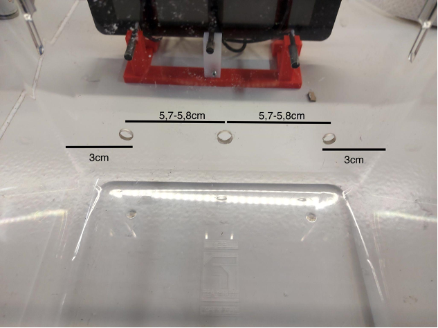

⚠️ **Important:**  
All hole positions should be determined using these distances. Do not rely solely on visual alignment.

---

## 🛠️ Required Tools

- Permanent marker
- Drill
- HSS drill bit (2.5 mm)
- Step drill (metric scale)
- Caliper
- Multi-tool with sanding tip  
  *or* sanding paper and hot air gun
- Safety equipment (gloves, eye protection)

---

## 📋 Procedure

### Step 1 – Cage Preparation
Clean the cage thoroughly. Make sure that the cage has no permanent marks or visible scratches.

📝 **Note:**  
If needed for identification purposes, label the cage with the corresponding **RP_id** at this stage.

---

### Step 2 – Initial Alignment
To confirm the exact locations, place the cage in front of an RP and confirm that the cage is centered in front of the screen.

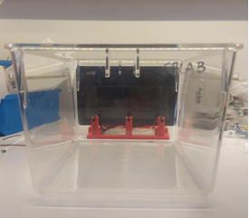
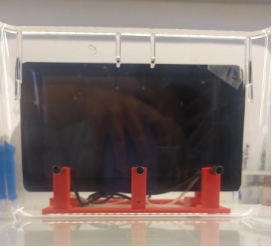

---

### Step 3 – Marking Hole Positions
Using the distances shown above, mark the positions of the two lateral lick ports on the **interior surface** of the cage.

- Mark one dot at the center of each port location.
- Use a caliper or ruler for accuracy.

---

### Step 4 – Drilling Pilot Holes
Use a small drill at the beginning (**HSS 2.5 mm**) and drill a hole exactly on each mark.

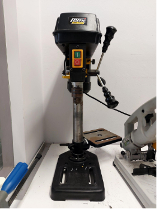

---

### Step 5 – Verification of Alignment
Place the cage in front of the RP and make sure the holes match the center of each lick port.

⚠️ **ATTENTION:**  
Perform this check every time the holes are modified to ensure correct alignment.

---

### Step 6 – Enlarging the Holes
Use the step drill to broaden the holes.

⚠️ **ATTENTION:**  
- Use the scale markings to control the final diameter.
- Ensure the scale is in **millimeters**, not inches.
- Verify diameter using a **caliper**.

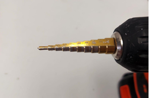

---

### Step 7 – Final Hole Diameters
- Final diameter of each lick port hole: **~7.5 mm**

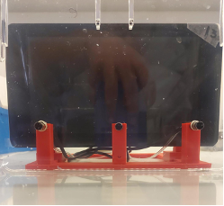
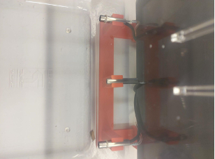

If speakers are part of the setup:
- Final diameter of each speaker hole: **~8.5 mm**

---

### Step 8 – Central Lick Port
After completing the lateral holes, place the cage in front of the RP and mark the center of the **central lick port** using the same distance-based method.

Repeat **Steps 4–7** for the central lick port.

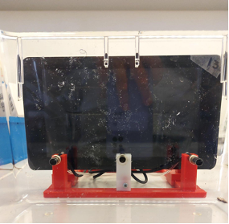
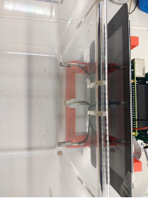

---

### Step 9 – Smoothing the Holes
Make the interior of all holes smooth to prevent irritation to the mouse.

Options:
- Use a **multi-tool with a small sanding tip**, or
- Use sanding paper followed by a **hot air gun (scale 1)** for a few seconds.

⚠️ **Be careful not to melt the plastic cage.**

Check smoothness gently with your finger.

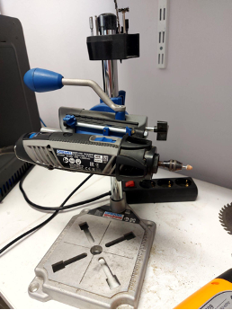
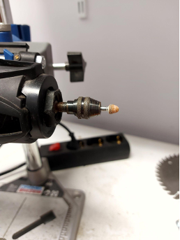

---

## ✅ Final Verification

- Confirm that all holes align correctly with the lick ports and speakers.
- Confirm that all hole edges are smooth.
- Confirm that hole diameters match specifications.

The cage is now ready for assembly.
