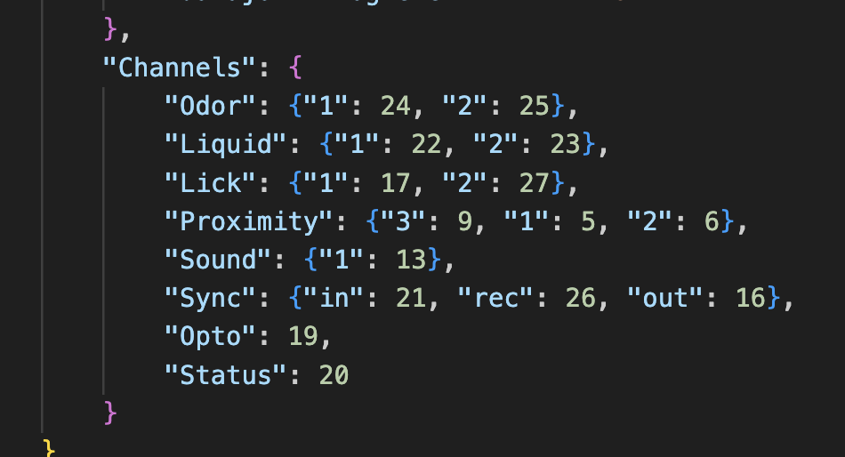
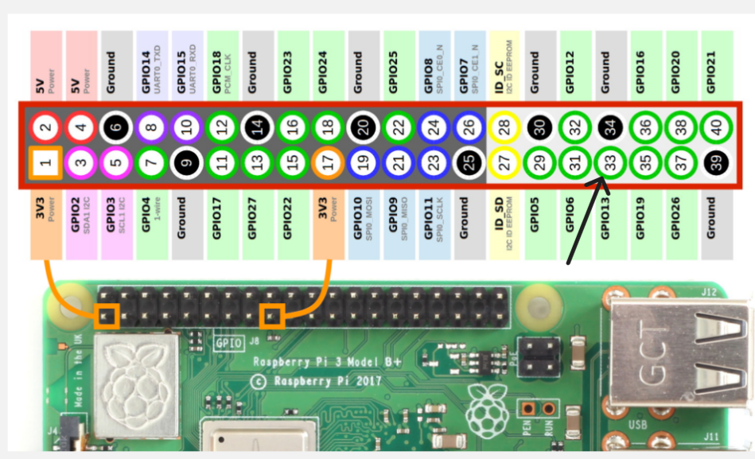

# Speakers' Setup
Speakers are used to provide auditory cues during behavioral experiments. They can be embedded within experimental setups to deliver sound stimuli. Below are the step-by-step instructions for setting up the speakers.

<figure id="fig1">
  
</figure>

## Hardware Parts List

### Electronics
| # | Item                           | Qty  | Source            | Identifier      | Notes                            |
|:-:|:-:                             |:-:   |:-:                |:-:              |:-:                               |

| 1 | Ultrasound Speakers 40kHz      | 2    | PUI Audio         | UT-1640K-TT-2-R | Transmitter                      |

| 2 | Speaker (Receiver)             | 1    | —                 | —               |                                  |

| 3 | Jumper wire (female-to-female) | 2    | GROBOTRONICS      | 05-00011907     |                                  |

| 4 | Heat shrink set                | 6    | Cyg, Grobotronics | 05-00017098     | Two 12cm and four 20cm Jumper wire |

### 3D Printed Parts
You will find the blueprints for the item you should 3D print [here](3d_designs/center_port_with_speakers.stl).

## Step-by-Step Assembly Instructions

**Step 1**. Select four long female-to-female jumper wires and connect one end of each to the pins of the speaker ([Fig. 1](#fig1)). Repeat this step twice.

<figure id="fig1">
  
  <figcaption><b>Figure 1</b>: <i>Speaker connected with female-to-female jumper wires</i></figcaption>
</figure>

**Step 2**. Remove the square female heads from the other ends of the wires.

**Step 3**. Solder the ends of two jumper wire (one from each speaker) together along with one small female-to-female jumper wire (after removing its square female head) ([Fig. 2](#fig2)).

<figure id="fig2">
  
  <figcaption><b>Figure 2</b>: <i>Soldering ends of two jumper wires</i></figcaption>
</figure>

**Step 4**. Cut a piece of heat shrink tube long enough to cover the exposed wires ([Fig. 3](#fig3)).

<figure id="fig3">
  
  <figcaption><b>Figure 3</b>: <i>Coverd part with heat shrink tube</i></figcaption>
</figure>

**Step 5**. Use the oscilloscope and connect one end (measuring clip) to one wire of the speaker and the grounding clip to the other wire ([Fig. 5](#fig5)).

<figure id="fig5">
  
  <figcaption><b>Figure 5</b>: <i>.....</i></figcaption>
</figure>

**Step 6**. Connect your speakers to your Raspberry Pi Pinout. First, go to the `EthoPy/Interfaces/RPPorts.py` and look at the `class RPPorts(Interface)`. Here, you see which channel corresponds to the RP GPIO pins based on what you want to connect. So, for **sound** is channel `GPIO 13` ([Fig. 6](#fig6)).

<figure id="fig6">
  
  <figcaption><b>Figure 6</b>: <i>Hardware mapping of behavioral sensor ports to GPIO pins</i></figcaption>
</figure>

Connect one wire of your speaker to `GPIO13` and the other wire to `ground`([Fig. 7](#fig7)).

<figure id="fig7">
  
  <figcaption><b>Figure 7</b>: <i>Rasberry Pi's GPIO pins</i></figcaption>
</figure>

**Step 7**. Open your RP and run a task with auditory stimuli.