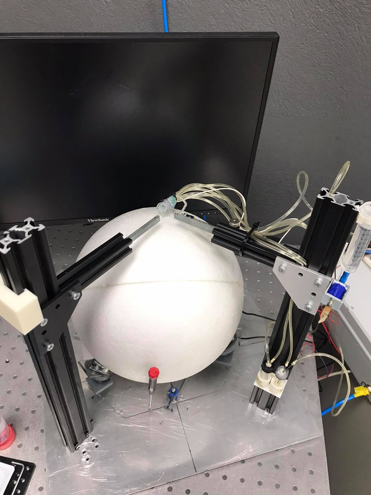
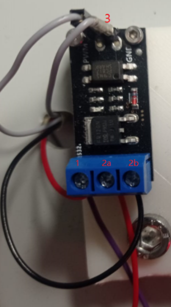
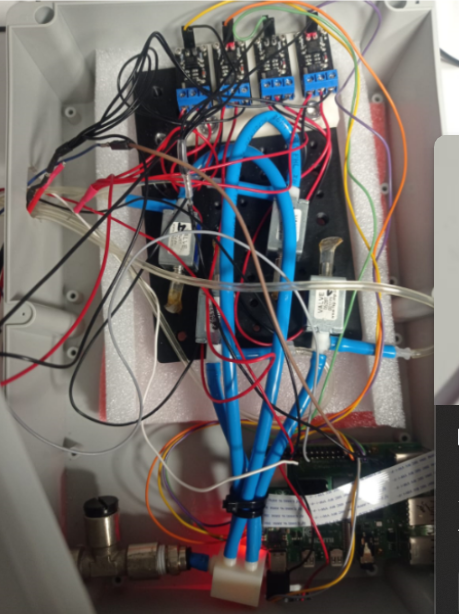
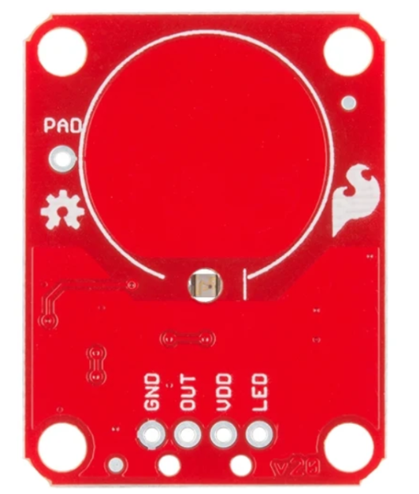
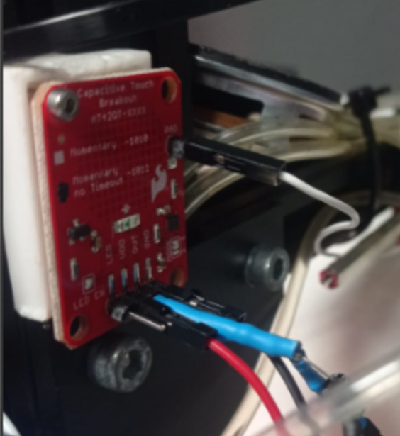
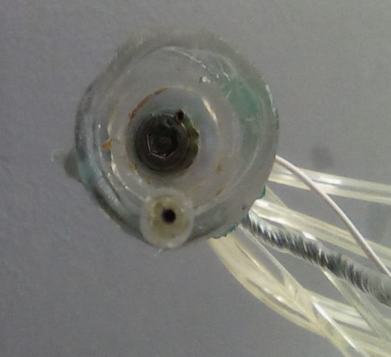

# Spherical Treadmill Behavioral Setup

The Spherical Treadmill (ball) behavioral setup is used for head-fixed mice performing sensory navigation tasks (e.g., olfactory, visual, multimodal). Below, we describe the protocol to construct an odor-based virtual reality setup.

<figure id="fig">
  
</figure>

## Hardware Parts List

### Electronics

| # | Item                      | Qty  | Source          | Identifier   |  Notes                                 |
|:-:|:-:                        |:-:   |:-:              |:-:           |:-:                                     |

| 1 | solenoid valves           | 5    | fspumb.cn       | 0526T        | 4 for odorants, 1 for water delivery   |

| 2 |MOSFET board               | 5    | OEM             | FR120N       | To control the solenoid valves         |

| 3 | Capacitive sensor board   | 1    | Sparkfun        | AT42QT1011   | for lick detection                     |

| 4 | laser mouse               | 2    | DELL            | MS3220       | ball sensors                           |

### Other Hardware

| # | Item                      | Qty  | Source          | Identifier   |  Notes                                 |
|:-:|:-:                        |:-:   |:-:              |:-:           |:-:                                     |

| 1 | ball bearings             | 3    | DFRobot         | FIT0007      |                                        |

| 2 | plastic box               | 1    | Kradex          | Z74HJ        | 30 x 20 x 10cm                         |

### 3D Printed Parts

You will find the blueprints for the items you should 3D print [here](3d_designs).

| # | Item                  | Qty | Filename                                                                        | Notes             |
|:-:|:-:                    |:-:  |:-:                                                                              |:-:                |

| 1 | mouse post            | 2   | [mouse_post.stl](3d_designs/mouse_post.stl)                 |                   |

| 2 | ball bearing holder   | 3   | [ball_bearing_holder.stl](3d_designs/ball-bearing-post.stl) |                   |

| 3 | 5-way tube connector  | 1   | [tube_connector.stl](3d_designs/tube_connector.stl)         |                   |

## Step-by-Step Assembly Instructions

Following instructions apply for any virtual reality system that uses a styrofoam ball on 3 ball bearings (similar to Fig. 4d of the EthoPy paper) <!--Add hyperlink-->, 4 odours to define an olfactory virtual environment, and a mouthpiece to deliver the odors but also the reward.

**Step 1**. Set up the [Raspberry Pi Behavioral Setup](../Homecage/README.md) following steps 1-5, the difference is that in this setup you need 5 valves ([Electronics parts list, item #1](#electro1)), for reward and 4 for odour delivery.

**Step 2**. A `Styrofoam ball` is supported by three (3) metallic ball bearings ([Other Hardware parts list, item #1](#other1)) allowing smooth navigation for prolonged periods. The bearings are supported by custom 3D-printed posts ([3D-printed parts, part #2](#printer2)) at a 45° angle, so the ball is stable while the subject is performing the task.

<figure id="fig1">
  
  <figcaption><b>Figure 1</b>: <i>Animated depiction of the experimental set-up. Mouse is head-fixed onto a styrofoam ball, with a mouthpiece securing the odor and water delivery.</i></figcaption>
</figure>

**Step 3**. The PCB boards of the laser mice ([Electronics parts list, item #4](#electro4)) are used as sensors to encode the ball movement. Laser mice holders ([3D-printed parts, part #1](#printer1)) are used to place the laser mice in an optimal position at 90⁰ degrees from each other, very close to the bearings, and at an incline of 55°, to eliminate the distance variation between the ball and the sensor that could lead to imprecise tracking information. Insert the PCB board of each laser mouse and ensure they have 2-3 mm distance from the surface of the ball ([Fig. 2](#fig2)).

<figure id="fig2">
  
  <figcaption><b>Figure 2</b>: <i>Schematic of the locations of the ball bearing holders (grey) and the laser mice (red).</i></figcaption>
</figure>

> **Note:** Details about the how EthoPy computes the distances covered by the animal are in [`vr_ball_readme.md`](https://github.com/ef-lab/ethopy_plugins/blob/main/spherical_treadmill/behaviors/vr_ball_readme.md)

**Step 4**. The odor and water delivery system requires constant air supply and 5 solenoid valves. The air supply is connected to a 5-way manifold ([3D-printed parts, part #3](#printer3)) with the 4 valves that open and close when a pulse is sent from the RP through the MOSFET ([Electronics parts list, item #2](#electro2)). Upon pulse delivery the valves open for the specified duration and the air travels through the odor bottle to the mouthpiece. Similarly for the water supply, water is delivered to the lick port inside the mouthpiece upon correct response. 

> **Note:** Odors are released depending on the animal's virtual location and are calculated in [`EthoPy Ball`](https://github.com/ef-lab/ethopy_plugins/blob/main/spherical_treadmill/stimuli/vr_odors_readme.md) 

<figure id="fig3">
  
  <figcaption><b>Figure 3</b>: <i>Animated depiction of the assembly of the stimuli that arrive at the mouthpiece odors (left) and water (right). </i></figcaption>
</figure>

### Electrical Connections

- `Valves’ control circuit`: To control the valves, we use a MOSFET board ([Electronics parts list, item #2](#electro2)) and connect the power and ground of the valve to the board, placing the power at position 2a and the ground at position 2b shown in [Fig. 4](#fig4). Then, to connect it with the Raspberry Pi, we select the pin of the RP we have programmed to trigger the valve and a ground pin and connect the other end to the PWR and GND pins respectively placed at the top part of the board (position 3, ([Fig. 4](#fig4))). Lastly, to turn on the board we need to insert 2 cables at position 1, one for the power and one for the ground of the power supply. In this last step, it is advised to make a 6-way cable assembly, both for the power and the ground, 5 of them going to each MOSFET board, and one connecting the power supply. This assembly can be placed in a plastic box ([Other Hardware parts list, item #2](#other2)).

<figure id="fig4">
  
  
  <figcaption><b>Figure 4</b>: <i>MOSFET boards for controlling the valves for the odorants </i></figcaption>
</figure>

- `Lick detector circuit`: The Capacitive sensor board ([Electronics parts list, item #3](#electro3)) consists of five pins: GND for ground, OUT for signal, VDD for power supply (1.8V - 5V), LED and PAD ([Fig. 5](#fig5)). In this case, only four of the pins are required (GND, OUT, VDD, and PAD). To connect the sensor for the lick detection it is important to solder a trimmed and polished 18G needle to the wire that will connect with the PAD pin. 

<figure id="fig5">
  
  
  
  <figcaption><b>Figure 5</b>: <i>Capacitive Touch Breakout board and Mouthpiece</i></figcaption>
</figure>

- `Laser mice`: Connect the laser mice to the two USB ports of the RP (each USB port will be assigned later in EthoPy code (Interfaces/Ball.py) to determine which laser mouse is responsible for decoding which axes)

